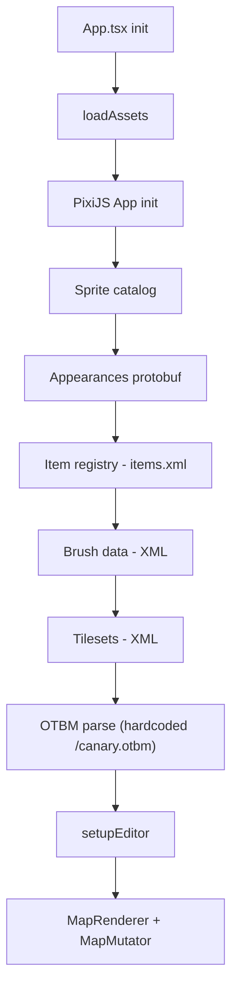
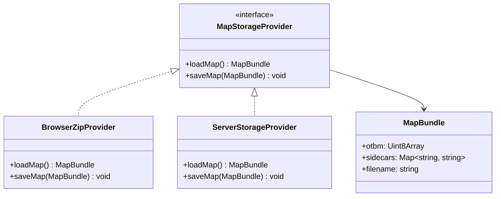
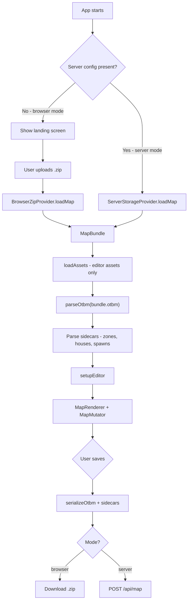

# Map I/O Architecture — Research

## Current State

- OTBM path is **hardcoded** to `/canary.otbm` in `src/lib/otbm.ts` (line 442), served from `tibia-versions/15.00/`
- Sidecar file names (houses, spawns) are **parsed from OTBM header** (`OTBM_ATTR_SPAWN_FILE`, `OTBM_ATTR_HOUSE_FILE`) but never loaded
- **No save/serialize** — editor is read-only (`serializeOtbm()` does not exist)
- Editor assets (appearances, sprites, brushes, tilesets) are **not map-specific** — same regardless of mode

### Current Init Pipeline



Step weights: `[2, 15, 3, 12, 8, 3, 50, 5]` — OTBM is 50% of total work.

### Key Files

| File | Role |
|------|------|
| `src/lib/initPipeline.ts` | Orchestrates all asset loading |
| `src/lib/setupEditor.ts` | Creates MapRenderer + MapMutator |
| `src/lib/otbm.ts` | OTBM binary parser (no serializer) |
| `src/App.tsx` | Root component, triggers init |
| `vite.config.ts` | Serves `tibia-versions/15.00/` as publicDir |

### OTBM Parser Exports (parse only)

- `loadOtbm(url?, onProgress?, onStatus?)` — async fetch + parse with progress
- `parseOtbm(raw: Uint8Array)` — synchronous parse (used in tests)
- `deepCloneItem(item)` — utility
- Data interfaces: `OtbmMap`, `OtbmTile`, `OtbmItem`, `OtbmTown`, `OtbmWaypoint`

### Sidecar Files Stored in OTBM Header

| Attribute | Field | Status |
|-----------|-------|--------|
| `OTBM_ATTR_SPAWN_FILE` | `map.spawnFile` | Parsed, not loaded |
| `OTBM_ATTR_HOUSE_FILE` | `map.houseFile` | Parsed, not loaded |
| `OTBM_ATTR_EXT_ZONE_FILE` (24) | Not implemented | See ZONES_RESEARCH.md |

## Two-Mode Architecture

Mode is determined at **runtime** — one build artifact serves both modes. When a server URL is configured, the editor operates in server mode; otherwise it defaults to browser mode. Only the **map data source** changes between modes — editor assets (appearances, sprites, brushes, tilesets) remain identical.

### Configuration

The server injects its config when serving the frontend (e.g. via a `<script>` tag or `/api/config` endpoint):

```ts
// Injected by server, absent in static browser deployments
window.__MAP_EDITOR_CONFIG__ = {
  mode: 'server',
  serverUrl: '/api',
};
```

When `window.__MAP_EDITOR_CONFIG__` is absent → browser mode. This gives one build that works for both deployment targets.



### Mode 1: Browser (Zip Upload)

- **Fully static** — compiles to HTML/JS/CSS, deployable on GitHub Pages with no server
- Landing screen with "Open Map" button (file picker for `.zip`)
- Zip contains `.otbm` + sidecar XMLs (zones, houses, spawns)
- Parse zip in-browser (e.g. `fflate`)
- Pass raw `Uint8Array` to existing `parseOtbm()`
- On save: serialize to zip, trigger browser download via `URL.createObjectURL()`

### Asset Sourcing

Client assets (appearances.dat, sprite sheets) cannot be bundled in the repo (CipSoft copyright). The existing `convert-sprites.ts` script already converts sprite sheets to PNG.

- **Browser mode**: a GitHub Action pulls client assets, runs `convert-sprites.ts`, and includes the resulting PNGs in the static build.
- **Server mode**: OTS creators mount a volume with their client files (appearances.dat, `.bmp.lzma` sprite sheets). The Docker entrypoint runs `convert-sprites.ts` on first start to produce PNGs, which are then served alongside the frontend.

### Mode 2: Server

- **Docker image** bundling the static frontend + a lightweight Node server (Express/Fastify)
- OTS creators provide client assets (appearances.dat, catalog-content.json, sprite sheets) and map files via volume mounts
- Entrypoint runs `convert-sprites.ts` to convert `.bmp.lzma` → PNG on container startup

```yaml
services:
  map-editor:
    image: tibia-map-viewer
    volumes:
      - ./data/world:/map        # OTBM + sidecars
      - ./data/client:/assets    # appearances.dat, catalog-content.json, .bmp.lzma sprite sheets
    ports:
      - "8080:8080"
```

- Server injects its config into the frontend, disabling browser upload UI
- `GET /api/map` — returns OTBM binary + sidecars from mounted volume
- `POST /api/map` — saves changes back to volume
- Future: WebSocket for collaborative editing

### Init Flow



## Implementation Order

1. **`MapStorageProvider` interface** — abstract load/save behind common API
2. **OTBM serializer** — `serializeOtbm()` (inverse of parser, doesn't exist yet)
3. **`BrowserZipProvider`** — zip upload/download with `fflate` or similar
4. **`ServerStorageProvider`** — Node server with Express/Fastify, Docker image
5. **Landing/mode selection UI** — landing screen for browser mode, auto-load for server mode
6. **Refactor `initPipeline.ts`** — split editor asset loading from map loading
7. **Sidecar file parsing** — actually load zones/houses/spawns XMLs
8. **GitHub Action for assets** — pull client data, run `convert-sprites.ts`, include PNGs in build
