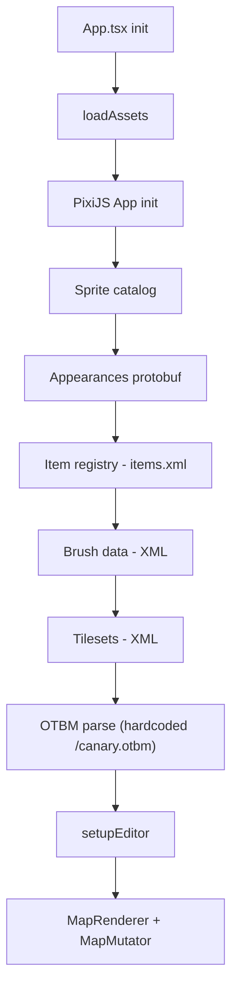
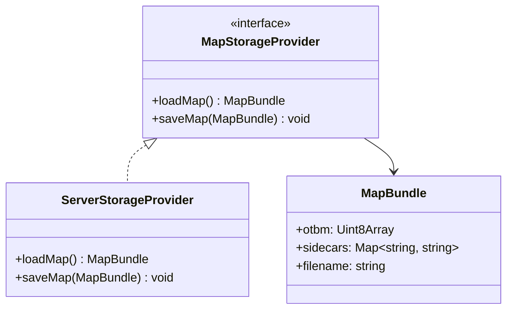
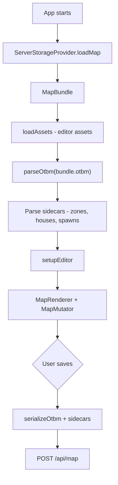

# Map I/O Architecture — Research

## Current State

- OTBM path is **hardcoded** to `/canary.otbm` in `src/lib/otbm.ts` (line 442), served from `tibia-versions/15.00/`
- Sidecar file names (houses, spawns) are **parsed from OTBM header** (`OTBM_ATTR_SPAWN_FILE`, `OTBM_ATTR_HOUSE_FILE`) but never loaded
- **Serialize implemented** — `serializeOtbm()` produces binary OTBM that round-trips through `parseOtbm()`
- Editor assets (appearances, sprites, brushes, tilesets) are **not map-specific** — same regardless of mode

### Current Init Pipeline



Step weights: `[2, 15, 3, 12, 8, 3, 50, 5]` — OTBM is 50% of total work.

### Key Files

| File | Role |
|------|------|
| `src/lib/initPipeline.ts` | Orchestrates all asset loading |
| `src/lib/setupEditor.ts` | Creates MapRenderer + MapMutator |
| `src/lib/otbm.ts` | OTBM binary parser + serializer |
| `src/App.tsx` | Root component, triggers init |
| `vite.config.ts` | Serves `tibia-versions/15.00/` as publicDir |

### OTBM Exports

- `loadOtbm(url?, onProgress?, onStatus?)` — async fetch + parse with progress
- `parseOtbm(raw: Uint8Array)` — synchronous parse (used in tests)
- `serializeOtbm(map: OtbmMap): Uint8Array` — serialize map to OTBM binary
- `deepCloneItem(item)` — utility
- Data interfaces: `OtbmMap`, `OtbmTile`, `OtbmItem`, `OtbmTown`, `OtbmWaypoint`

### Sidecar Files Stored in OTBM Header

| Attribute | Field | Status |
|-----------|-------|--------|
| `OTBM_ATTR_SPAWN_FILE` | `map.spawnFile` | Parsed, not loaded |
| `OTBM_ATTR_HOUSE_FILE` | `map.houseFile` | Parsed, not loaded |
| `OTBM_ATTR_EXT_SPAWN_NPC_FILE` (23) | `map.npcFile` | Parsed, not loaded |
| `OTBM_ATTR_EXT_ZONE_FILE` (24) | `map.zoneFile` | Parsed, not loaded |

## Target Architecture

Docker image bundling the static frontend + a lightweight Node server. OTS creators provide client assets and map files via volume mounts. A single build artifact — mode detection is not needed in the initial implementation.

### Storage Interface

Even though we start with server-only, defining an interface keeps the door open for a future browser mode without refactoring.



### Deployment

```yaml
services:
  map-editor:
    image: tibia-map-viewer
    volumes:
      - ./data/world:/map        # OTBM + sidecars
      - ./data/client:/assets    # appearances.dat, catalog-content.json, .bmp.lzma sprite sheets
    ports:
      - "8080:8080"
```

- Entrypoint runs `convert-sprites.ts` to convert `.bmp.lzma` → PNG on container startup
- Server serves converted PNGs + frontend static files
- `GET /api/map` — returns OTBM binary + sidecars from mounted volume
- `POST /api/map` — saves changes back to volume

### Init Flow



## Implementation Order

1. ~~**OTBM serializer**~~ — `serializeOtbm()` ✅ implemented, byte-identical round-trip verified with canary.otbm and habitats.otbm
2. **`MapStorageProvider` interface + `ServerStorageProvider`** — load/save via HTTP
3. **Node server** — Express/Fastify with `GET /api/map` and `POST /api/map`
4. **Refactor `initPipeline.ts`** — split editor asset loading from map loading, consume `MapBundle`
5. **Sidecar file parsing** — load zones/houses/spawns XMLs from bundle
6. **Dockerfile** — static frontend + server, entrypoint runs `convert-sprites.ts`

## Future: Browser Mode

A fully static deployment (GitHub Pages) using zip upload/download. Not planned for initial implementation but the `MapStorageProvider` interface supports it.

- Landing screen with "Open Map" button (file picker for `.zip`)
- Zip contains `.otbm` + sidecar XMLs; parse in-browser with `fflate`
- On save: serialize to zip, trigger browser download
- Asset sourcing: GitHub Action pulls from [dudantas/tibia-client](https://github.com/dudantas/tibia-client), runs `convert-sprites.ts`, includes PNGs in static build
- Would require a `BrowserZipProvider` implementing `MapStorageProvider`
- Mode detection via `window.__MAP_EDITOR_CONFIG__` (present = server, absent = browser)
