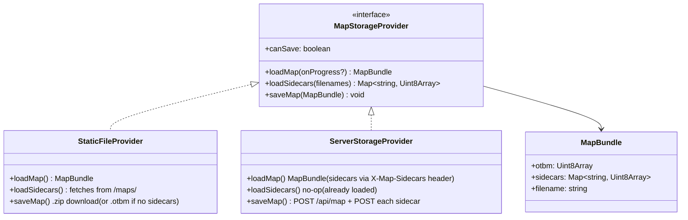
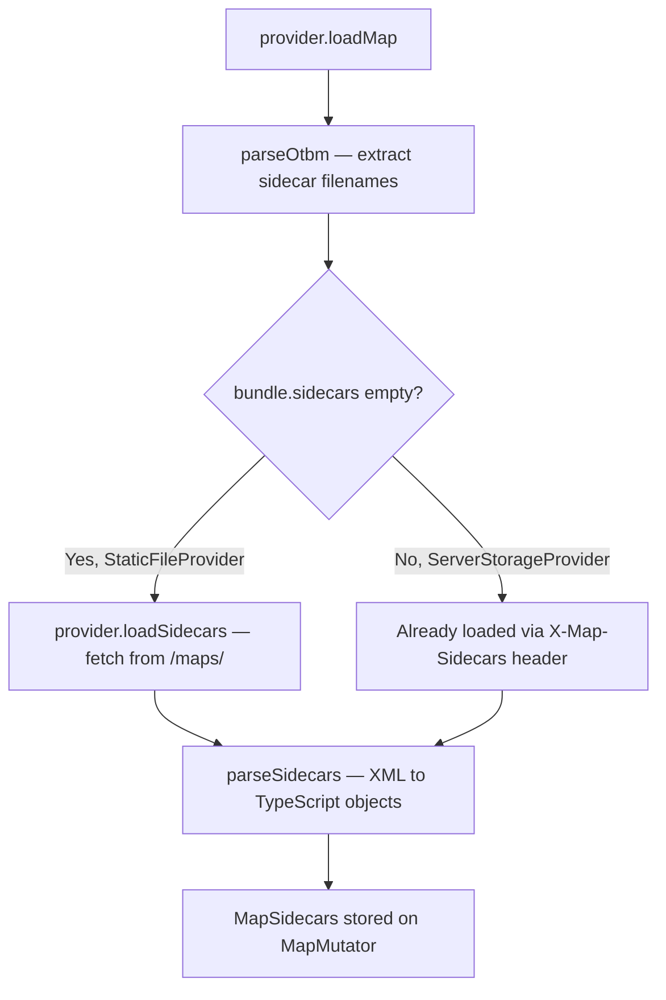
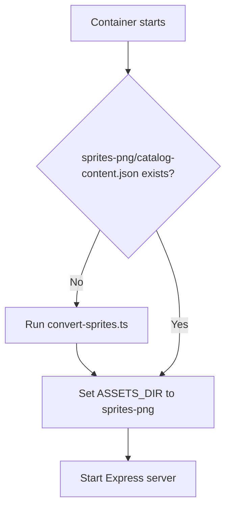

# Map I/O Architecture

## Storage Providers

Storage provider is selected at build time via `VITE_STORAGE` env var (default: `static`).



| Provider | `VITE_STORAGE` | Map source | Save behavior | Use case |
|----------|---------------|------------|---------------|----------|
| `StaticFileProvider` | `static` | `GET /maps/<file>` | `.zip` download (OTBM + sidecars) or plain `.otbm` if no sidecars | Local dev (`npm run dev`) |
| `ServerStorageProvider` | `server` | `GET /api/map` | `POST /api/map` + `POST /api/map/sidecars/:name` | Docker / production |

### Key Files

| File | Role |
|------|------|
| `src/lib/storage/MapStorageProvider.ts` | Interface definition |
| `src/lib/storage/StaticFileProvider.ts` | Static file loading + zip download save |
| `src/lib/storage/ServerStorageProvider.ts` | HTTP API client |
| `src/lib/sidecars.ts` | Sidecar XML parsing + serialization (houses, spawns, NPCs, zones) |
| `src/lib/initPipeline.ts` | Orchestrates all asset loading |
| `src/lib/setupEditor.ts` | Creates MapRenderer + MapMutator |
| `src/lib/otbm.ts` | OTBM binary parser + serializer |
| `src/App.tsx` | Root component, provider selection via `VITE_STORAGE` |

### OTBM Exports

- `parseOtbm(raw: Uint8Array)` — synchronous parse
- `serializeOtbm(map: OtbmMap): Uint8Array` — serialize map to OTBM binary (byte-identical round-trip verified)
- Data interfaces: `OtbmMap`, `OtbmTile`, `OtbmItem`, `OtbmTown`, `OtbmWaypoint`

### Sidecar Files

Sidecar filenames are stored in the OTBM header. After OTBM parsing, the init pipeline loads and parses these XML files into `MapSidecars` (stored on `MapMutator`).

| Attribute | Field | XML root | Parsed type |
|-----------|-------|----------|-------------|
| `OTBM_ATTR_SPAWN_FILE` | `map.spawnFile` | `<monsters>` | `SpawnPoint[]` |
| `OTBM_ATTR_HOUSE_FILE` | `map.houseFile` | `<houses>` | `HouseData[]` |
| `OTBM_ATTR_EXT_SPAWN_NPC_FILE` (23) | `map.npcFile` | `<npcs>` | `SpawnPoint[]` |
| `OTBM_ATTR_EXT_ZONE_FILE` (24) | `map.zoneFile` | `<zones>` | `ZoneData[]` |

#### Loading flow



#### Save flow

- `serializeSidecars(sidecars, map)` converts `MapSidecars` back to XML, populates `bundle.sidecars`
- `ServerStorageProvider`: POSTs OTBM then each sidecar file individually
- `StaticFileProvider`: bundles OTBM + sidecars into a single `.zip` download (uses `fflate`); if no sidecars, downloads plain `.otbm`

#### Spawn coordinate convention

- Spawn creatures store **absolute positions** at runtime (parser converts relative offsets from center to absolute)
- Serializer converts back to relative offsets for XML output

## Server

Express 5 server (`server/`) serves the map API, static frontend, client assets, and data files.

### File Structure

```
server/
  index.ts              -- Express app setup + listen
  config.ts             -- Env var parsing (PORT, MAP_DIR, ASSETS_DIR)
  lib/
    mapDir.ts           -- Find .otbm file, list sidecar files
  routes/
    map.ts              -- GET/POST /api/map, GET/POST /api/map/sidecars/:name
```

### API Endpoints

| Method | Path | Description |
|--------|------|-------------|
| `GET` | `/api/map` | Stream OTBM file. Headers: `Content-Disposition`, `Content-Length`, `X-Map-Sidecars` |
| `GET` | `/api/map/sidecars/:name` | Stream sidecar file (path traversal protected) |
| `POST` | `/api/map` | Save OTBM file. Body: raw binary. Header: `X-Map-Filename`. Atomic write (`.tmp` + rename) |
| `POST` | `/api/map/sidecars/:name` | Save sidecar file. Body: raw binary. Atomic write (`.tmp` + rename) |

### Static File Serving

| URL path | Source | Notes |
|----------|--------|-------|
| `/` | `dist/` | Built frontend (SPA fallback to `index.html`) |
| `/sprites-png/*` | `ASSETS_DIR` | Converted PNG sprites |
| `/data/*` | `data/` | Brush/tileset XMLs, items.xml (baked into image) |
| `/*` | `ASSETS_DIR` | Root-level asset fallback |

### Environment Variables

| Variable | Default | Description |
|----------|---------|-------------|
| `PORT` | `8080` | Server listen port |
| `MAP_DIR` | — | Directory containing `.otbm` and sidecar files |
| `ASSETS_DIR` | — | Directory containing sprites and appearances |
| `MAP_FILE` | (auto-detect) | Specific `.otbm` filename to serve |

## Docker

### Dockerfile

Multi-stage build: `deps` → `build` (frontend) → `production`.

- Frontend built with `VITE_STORAGE=server`
- `data/` baked into image
- `lzma-native` + `sharp` installed for sprite conversion
- Entrypoint (`docker-entrypoint.sh`) converts `.bmp.lzma` → PNG on first start

### docker-compose.yml

```yaml
services:
  editor:
    build: .
    user: "${UID:-1000}:${GID:-1000}"
    ports:
      - "${PORT:-8080}:8080"
    volumes:
      - ./tibia/sprites:/app/sprites:ro   # Client sprite sheets
      - ./maps:/app/maps                                  # OTBM + sidecars (read-write)
      - sprites-png:/app/sprites-png                      # Converted PNGs (persistent cache)
    restart: unless-stopped

volumes:
  sprites-png:
```

`UID`/`GID` env vars (default `1000`) ensure files written to `./maps` have correct host ownership.

### Entrypoint Flow



The `sprites-png` named volume persists converted sprites across container restarts.

## Local Development

### Setup

```bash
npm run convert-sprites    # One-time: convert .bmp.lzma → PNG
npm run dev                # Vite dev server (StaticFileProvider)
```

Vite serves files via plugins:
- `/sprites-png/*` → `tibia/sprites-png/`
- `/data/*` → `data/`
- `/maps/*` → `maps/`

### With Server (optional)

```bash
npm run server:dev         # Terminal 1: Express on :8080
VITE_STORAGE=server npm run dev  # Terminal 2: Vite proxies /api → :8080
```

## Implementation Status

1. ~~**OTBM serializer**~~ — `serializeOtbm()` ✅
2. ~~**`MapStorageProvider` interface + providers**~~ — `StaticFileProvider` + `ServerStorageProvider` ✅
3. ~~**Node server**~~ — Express 5 with map API ✅
4. ~~**Refactor `initPipeline.ts`**~~ — consumes `MapBundle` from provider ✅
5. ~~**Sidecar file parsing**~~ — load zones/houses/spawns XMLs from bundle ✅
6. ~~**Docker**~~ — Dockerfile + docker-compose + entrypoint with sprite conversion ✅

## Future: Browser Mode

A fully static deployment (GitHub Pages) using zip upload/download. The `MapStorageProvider` interface supports it.

- Landing screen with "Open Map" button (file picker for `.zip`)
- Zip contains `.otbm` + sidecar XMLs; parse in-browser with `fflate` (already a dependency)
- On save: serialize to zip, trigger browser download (same pattern as `StaticFileProvider`)
- Asset sourcing: GitHub Action pulls from [dudantas/tibia-client](https://github.com/dudantas/tibia-client), runs `convert-sprites.ts`, includes PNGs in static build
- Would require a `BrowserZipProvider` implementing `MapStorageProvider`
