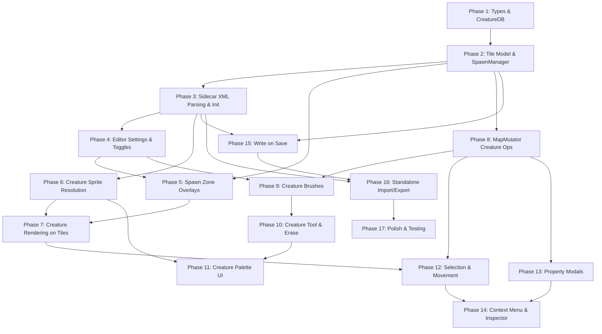

# Creature System — Progress Tracker

**PRD**: [PRD-creatures.md](./PRD-creatures.md)

## Phase 1: Types & Creature Database

> New files only, no existing code modified. Pure data layer.

- [x] Define `Direction` enum (NORTH=0, EAST=1, SOUTH=2, WEST=3) in `src/lib/creatures/types.ts`
- [x] Define `TileCreature` interface (name, direction, spawnTime, weight?, isNpc)
- [x] Define `CreatureType` interface (name, lookType, lookItem?, lookHead/Body/Legs/Feet?, lookAddon?, lookMount?, isNpc)
- [x] Create creature data files (`data/creatures/monsters.xml`, `data/creatures/npcs.xml`)
- [x] Implement `CreatureDatabase` class in `src/lib/creatures/CreatureDatabase.ts`
- [x] Parse monsters.xml (attribute format: `<monster name="Rat" looktype="21"/>`)
- [x] Parse npcs.xml (attribute format: `<npc name="Josef" looktype="131" .../>`)
- [x] `getByName(name)` lookup (case-insensitive)
- [x] `getAllMonsters()` / `getAllNpcs()` list methods
- [x] Tests: creature database loading, lookup by name, case-insensitivity, unknown name returns undefined

## Phase 2: Tile Model & Spawn Manager

> Extends OtbmTile, adds SpawnManager class. No rendering, no pipeline changes yet.

- [x] Extend `OtbmTile` with `monsters: TileCreature[]` field
- [x] Extend `OtbmTile` with `npc?: TileCreature` field
- [x] Extend `OtbmTile` with `spawnMonster?: { radius: number }` field
- [x] Extend `OtbmTile` with `spawnNpc?: { radius: number }` field
- [x] Implement `SpawnManager` class in `src/lib/creatures/SpawnManager.ts` — data structures (monsterSpawns, npcSpawns sets, spawn count maps)
- [x] `getTilesInRadius(centerX, centerY, centerZ, radius)` helper (square area)
- [x] `addMonsterSpawn(center, radius)` / `removeMonsterSpawn(center, radius)` — updates spawn counts on all tiles in radius
- [x] `addNpcSpawn(center, radius)` / `removeNpcSpawn(center, radius)` — same for NPC
- [x] Query methods: `getMonsterSpawnCount(x,y,z)`, `getNpcSpawnCount(x,y,z)`, `isInMonsterSpawn()`, `isInNpcSpawn()`
- [x] Tests: spawn add/remove, count tracking, radius coverage, overlapping zones increment correctly, remove decrements

## Phase 3: Sidecar XML Parsing & Init Pipeline

> Loads creatures from sidecar XML files when opening a map. Wires CreatureDatabase + SpawnManager into init flow.

- [x] Implement `applyMonsterSpawns()` in `src/lib/creatures/applySpawns.ts` — bridges parsed `SpawnPoint[]` → tile model + SpawnManager
- [x] Implement `applyNpcSpawns()` in `src/lib/creatures/applySpawns.ts` — same pattern for NPCs → set tile's `npc`
- [x] Handle unknown creature names (log warning, still load creature with name preserved)
- [x] Handle empty names / invalid direction gracefully (skip bad entries, clamp direction)
- [x] Add `CreatureDatabase` loading to `loadAssets()` in `initPipeline.ts` (after appearances)
- [x] `data/creatures/` already served by Vite (in `data/` publicDir)
- [x] Call `applyMonsterSpawns` / `applyNpcSpawns` after sidecar parsing in init pipeline
- [x] Add `spawnManager` + `creatureDb` properties to `MapMutator`
- [x] Pass `SpawnManager` + `CreatureDatabase` through `InitResult` to `setupEditor()`
- [x] Wire `spawnManager` + `creatureDb` through `useEditorInit.ts` → `setupEditor()`
- [x] Tests: valid spawns, unknown creatures preserved, empty spawns, multiple creatures on tile, NPC replacement, direction clamping, tile creation, SpawnManager integration

## Phase 4: Editor Settings & Visibility Toggles

> Adds settings + App.tsx state + hamburger menu entries. No rendering yet — just the wiring.

- [ ] Add `showMonsters: boolean` (default `true`) to `EditorSettings`
- [ ] Add `showMonsterSpawns: boolean` (default `true`) to `EditorSettings`
- [ ] Add `showNpcs: boolean` (default `true`) to `EditorSettings`
- [ ] Add `showNpcSpawns: boolean` (default `true`) to `EditorSettings`
- [ ] Add `autoCreateSpawn: boolean` (default `true`) to `EditorSettings`
- [ ] Update `mergeWithDefaults()` to parse new settings
- [ ] Add `useState` for all 4 show states in `App.tsx`
- [ ] Add toggle callbacks for each setting
- [ ] Sync in `handleSettingsChange`
- [ ] Add "Show Monsters" toggle entry in hamburger menu
- [ ] Add "Show Monster Spawns" toggle entry in hamburger menu
- [ ] Add "Show NPCs" toggle entry in hamburger menu
- [ ] Add "Show NPC Spawns" toggle entry in hamburger menu

## Phase 5: Spawn Zone Overlays

> Overlay rendering classes + MapRenderer wiring. Depends on Phase 2 (SpawnManager) and Phase 4 (settings).

- [ ] Create `MonsterSpawnOverlay` class (warm red/orange tint, intensity *= 0.7 per overlapping spawn)
- [ ] Create `NpcSpawnOverlay` class (cool blue/cyan tint, same overlap behavior)
- [ ] Spawn center indicator (distinct icon/border on center tile vs covered tiles)
- [ ] Add `MonsterSpawnOverlay` + `NpcSpawnOverlay` instances to `MapRenderer`
- [ ] Wire overlays into `update()` render loop
- [ ] Wire overlays into `destroy()` cleanup
- [ ] Wire overlays into `recycleAllChunks()`
- [ ] Add overlays to `FloorManager` overlay list
- [ ] Add `setShowMonsterSpawnOverlay(v)` / `setShowNpcSpawnOverlay(v)` methods on renderer
- [ ] Add `setShowMonsters(v)` / `setShowNpcs(v)` methods on renderer (for creature sprite visibility later)
- [ ] Sync saved settings to renderer on init in `useEditorInit.ts`
- [ ] Tests: overlay renders for tiles with spawn coverage, intensity with overlapping zones, toggle on/off

## Phase 6: Creature Sprite Resolution

> Resolves outfit lookType/lookItem to renderable sprites. No tile rendering integration yet — just the resolution logic.

- [ ] Implement `CreatureSpriteResolver` in `src/lib/creatures/CreatureSpriteResolver.ts`
- [ ] Resolve `lookType` → outfit appearance from appearances data → extract idle sprite ID for given `Direction`
- [ ] Resolve `lookItem` fallback → use existing `SpriteResolver` to get item sprite
- [ ] Handle missing/unknown outfits → return placeholder identifier
- [ ] Tests: lookType resolution for each direction, lookItem fallback, missing outfit returns placeholder

## Phase 7: Creature Rendering on Tiles

> Integrates creature sprites into TileRenderer. Depends on Phase 5 (renderer methods) and Phase 6 (sprite resolution).

- [ ] Render creature sprites in `TileRenderer` AFTER all item layers (creatures on top)
- [ ] Render order: monsters first (in array order), then NPC on top
- [ ] Respect `showMonsters` setting — skip monster rendering when false
- [ ] Respect `showNpcs` setting — skip NPC rendering when false
- [ ] Tests: creatures render after items, visibility toggle skips rendering, render order correct

## Phase 8: MapMutator Creature Operations

> All creature/spawn mutations with undo/redo. Depends on Phase 2 (tile model, SpawnManager).

- [ ] `placeCreature(x, y, z, creature: TileCreature)` — add monster to array or set NPC (with undo)
- [ ] `removeCreature(x, y, z, creatureName, isNpc)` — remove from tile (with undo)
- [ ] `moveCreature(from, to, creatureName, isNpc)` — remove from source + add to target (with undo)
- [ ] `updateCreatureProperties(x, y, z, creatureName, isNpc, props)` — edit direction/spawnTime/weight (with undo)
- [ ] `placeSpawnZone(x, y, z, type, radius)` — set spawnMonster/spawnNpc on tile + update SpawnManager (with undo)
- [ ] `removeSpawnZone(x, y, z, type)` — remove spawn marker + update SpawnManager (with undo)
- [ ] `updateSpawnRadius(x, y, z, type, newRadius)` — change radius + re-calculate SpawnManager counts (with undo)
- [ ] Tests: each operation forward + undo, placeCreature duplicate monster skip, NPC replace, spawn zone undo restores counts

## Phase 9: Creature Brushes

> Brush implementations. Depends on Phase 8 (MapMutator ops) and Phase 4 (autoCreateSpawn setting).

- [ ] Add `{ mode: 'creature'; creatureName: string; isNpc: boolean }` to `BrushSelection` type
- [ ] Add `{ mode: 'spawn'; spawnType: 'monster' | 'npc' }` to `BrushSelection` type
- [ ] Implement `MonsterBrush` — `canDraw()`: ground exists, not PZ, has spawn coverage or auto-create. `draw()`: adds monster (skips duplicate same-type)
- [ ] Implement `NpcBrush` — `canDraw()`: ground exists, has spawn coverage or auto-create. `draw()`: replaces existing NPC
- [ ] Implement `SpawnMonsterBrush` — `canDraw()`: ground exists, no existing spawnMonster. `draw()`: create spawn zone with brush size as radius
- [ ] Implement `SpawnNpcBrush` — same pattern as SpawnMonsterBrush for NPCs
- [ ] Auto-create logic: when placing creature without spawn coverage, create spawn(radius=1) on that tile first
- [ ] Tests: MonsterBrush (normal, duplicate skip, PZ block, no-spawn block), NpcBrush (normal, replaces existing), SpawnBrushes, auto-create

## Phase 10: Creature Tool & Erase Extension

> Hook up creature tool to editor tool system. Depends on Phase 9 (brushes).

- [ ] Create `creatureTool.ts` — click handler: place creature or spawn zone via MapMutator
- [ ] Smear support: drag to place creature on multiple tiles
- [ ] Update `hoverHandler.ts` — creature tool cursor (brush size for spawn mode, single tile for creature mode)
- [ ] Update `useEditorTools.ts` — add `'creature'` tool to onDown/onMove/onUp switch cases + cursor style
- [ ] Update `Toolbar.tsx` — add `'creature'` to `EditorTool` type and TOOLS array
- [ ] Extend erase tool to remove creatures from tiles
- [ ] Extend erase tool to remove spawn zones from tiles
- [ ] Tests: creature tool placement, smear, erase removes creatures + spawns

## Phase 11: Creature Palette UI

> New palette component. Depends on Phase 6 (sprite previews), Phase 9 (BrushSelection), Phase 10 (creature tool).

- [ ] Create `CreaturePalette.tsx` shell with Monsters / NPCs tabs
- [ ] Creature list: scrollable, shows outfit sprite preview + name per entry
- [ ] Search field: filter creature list by name substring
- [ ] Tileset category dropdown (filter by creature tileset categories)
- [ ] Mode toggle: "Place Creature" vs "Place Spawn Zone" (switches BrushSelection mode)
- [ ] Spawn time spinner (applies to placed creatures, default 60s)
- [ ] Spawn radius spinner (visible in spawn zone mode, 1-15)
- [ ] Weight spinner (visible in monster creature mode, 0-255)
- [ ] Add `showCreaturePalette` state variable + toggle callback in `App.tsx`
- [ ] Add creature-related state: `selectedCreature`, `creatureSpawnTime`, `creatureSpawnRadius`, `creatureWeight`
- [ ] Wire `CreaturePalette` component into layout
- [ ] `useToolAutoToggle` for creature tool ↔ creature palette
- [ ] Add `showCreaturePalette` to `EditorSettings`
- [ ] Add "Creature Palette" toggle entry in hamburger menu

## Phase 12: Selection & Movement

> Select and drag-move creatures. Depends on Phase 7 (rendering, click targets) and Phase 8 (moveCreature).

- [ ] Click on tile with creature → select creature (prioritize: spawnMonster > top monster > spawnNpc > NPC, like RME)
- [ ] Drag selected creature → move via `MapMutator.moveCreature()` (with undo)

## Phase 13: Creature & Spawn Property Modals

> Edit creature/spawn properties via modals. Depends on Phase 8 (updateCreatureProperties, updateSpawnRadius).

- [ ] Creature properties modal component — name (read-only), direction (dropdown N/E/S/W), spawn time (spinner), weight (spinner, monsters only)
- [ ] Spawn zone properties modal component — spawn type (read-only), radius (spinner 1-15)
- [ ] Open creature modal via: context menu "Properties" or double-click on creature
- [ ] Open spawn modal via: context menu "Properties" or double-click on spawn center
- [ ] Modals call `MapMutator.updateCreatureProperties()` / `MapMutator.updateSpawnRadius()` on save

## Phase 14: Context Menu & Inspector

> Context menu entries + inspector creature display. Depends on Phase 12 (selection) and Phase 13 (modals).

- [ ] Add "Properties..." context menu entry for creatures → opens creature modal
- [ ] Add "Properties..." context menu entry for spawn zone centers → opens spawn modal
- [ ] Add "Delete" context menu entry for creatures → calls `MapMutator.removeCreature()`
- [ ] Add "Delete" context menu entry for spawn zones → calls `MapMutator.removeSpawnZone()`
- [ ] Add "Rotate" context menu entry for creatures (cycles direction N→E→S→W)
- [ ] Show creatures on tile in inspector panel (below items)
- [ ] Display creature name + type (monster/NPC) + direction indicator in inspector

## Phase 15: Serialization — Write on Save

> Write sidecar XML files when saving OTBM. Depends on Phase 2 (SpawnManager) and Phase 3 (parser for round-trip tests).

- [ ] Implement `writeMonsterSpawnXml(mapData, spawnManager)` in `src/lib/creatures/spawnXmlWriter.ts`
- [ ] Iterate monster spawn centers, collect creatures within radius, generate XML with relative offsets
- [ ] Implement `writeNpcSpawnXml(mapData, spawnManager)` — same for NPC spawns
- [ ] Warn on orphan creatures (outside any spawn zone) — log but don't crash
- [ ] Hook into OTBM save flow to write sidecar files alongside .otbm
- [ ] Tests: write monster spawn XML (round-trip with parser), NPC XML, relative offset calculation, orphan warning

## Phase 16: Standalone Import/Export

> Menu-driven import/export of spawn files. Depends on Phase 3 (parser) and Phase 15 (writer).

- [ ] Import monster spawns from standalone XML file (merge into current map)
- [ ] Import NPC spawns from standalone XML file
- [ ] Export monster spawns to standalone XML file
- [ ] Export NPC spawns to standalone XML file
- [ ] Add "Import Monster Spawns..." hamburger menu entry
- [ ] Add "Import NPC Spawns..." hamburger menu entry
- [ ] Add "Export Monster Spawns..." hamburger menu entry
- [ ] Add "Export NPC Spawns..." hamburger menu entry

## Phase 17: Polish & Testing

- [ ] Edge case: orphan creatures (outside any spawn zone)
- [ ] Edge case: overlapping spawn zones (multiple spawn counts, overlay intensity)
- [ ] Edge case: auto-create spawn when placing creature without coverage
- [ ] Edge case: deleting spawn zone with creatures inside (creatures become orphans)
- [ ] Performance: large spawn zones (radius 15+ covering many tiles)
- [ ] Keyboard shortcuts for 4 visibility toggles
- [ ] Comprehensive integration tests (full workflow: load map → place spawn → place creature → save → reload → verify)
- [ ] Manual QA pass with RME-exported maps

---

## Phase Dependency Graph

---

## Status Legend
- [ ] Not started
- [x] Complete
- [~] In progress
